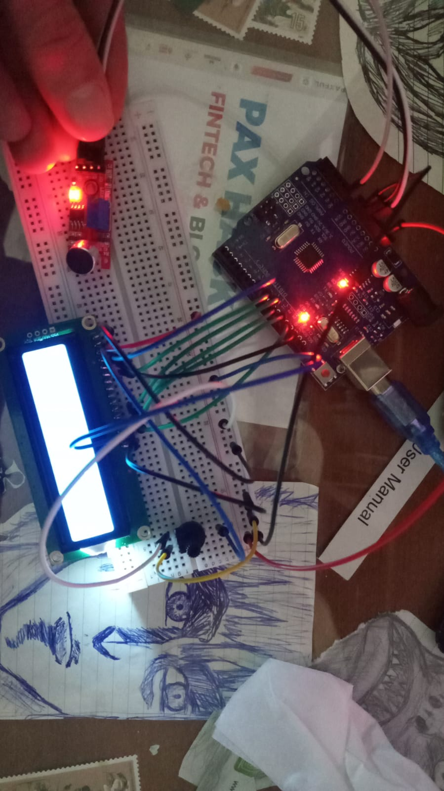
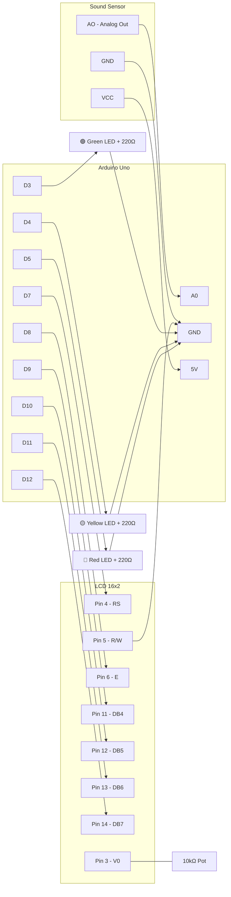
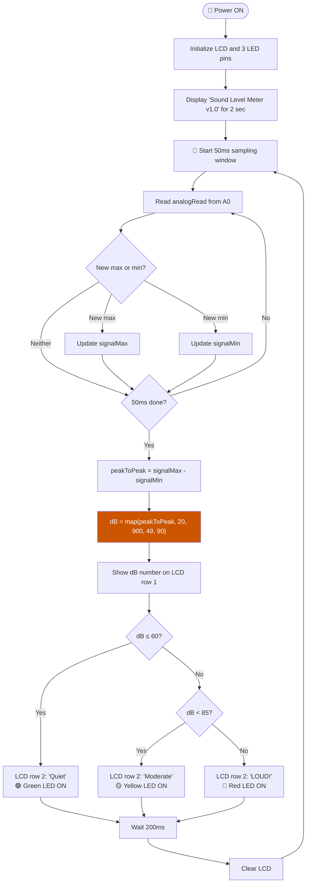

# 🔊 Sound Level Meter v1.0 — My First Audio Project

This is the first version of my Arduino sound level meter. It reads noise from an analog sound sensor, estimates the decibel level, shows it on a 16x2 LCD, and turns on colored LEDs depending on how loud the environment is. It's simple but it works — and building it taught me more about electronics than I expected.



> ▶ [Demo video](https://youtube.com/shorts/85OEcRe_1FY?si=_X9sWY59fgYg-t49)

---

## What It Does

The LCD displays two lines — the current dB reading and a label telling you if the room is quiet, moderate, or loud. Three LEDs give you a quick glance without reading the screen.

```
┌────────────────┐
│Loudness: 67 dB │
│Level: Moderate │
└────────────────┘

🟢 Green  = Quiet    (≤ 60 dB)
🟡 Yellow = Moderate (60–85 dB)
🔴 Red    = Loud     (≥ 85 dB)
```

I picked 85 dB as the "loud" threshold because that's the level where OSHA and EU regulations say you need hearing protection. It felt like a meaningful cutoff rather than an arbitrary number.

---

## Parts I Used

| Part | Why I Need It |
|------|--------------|
| Arduino Uno R3 | Runs everything |
| 16x2 LCD (parallel HD44780) | Shows the dB number and level label |
| Analog sound sensor module | Picks up sound and turns it into a voltage |
| 10kΩ Potentiometer | Adjusts LCD contrast (wired to V0) |
| Green LED + 220Ω resistor | Quiet indicator |
| Yellow LED + 220Ω resistor | Moderate indicator |
| Red LED + 220Ω resistor | Loud indicator |
| Breadboard + wires | Connects everything |

---

## How I Wired It

### LCD (Parallel 4-bit)

| LCD Pin | Name | Goes To |
|---------|------|---------|
| 1 | VSS | GND |
| 2 | VDD | 5V |
| 3 | V0 | Potentiometer middle pin |
| 4 | RS | Arduino D7 |
| 5 | R/W | **GND** |
| 6 | E | Arduino D8 |
| 7–10 | DB0–DB3 | Nothing (4-bit mode) |
| 11 | DB4 | Arduino D9 |
| 12 | DB5 | Arduino D10 |
| 13 | DB6 | Arduino D11 |
| 14 | DB7 | Arduino D12 |
| 15 | LED+ | 5V |
| 16 | LED- | GND |

### Sound Sensor

| Pin | Arduino |
|-----|---------|
| AO | A0 |
| VCC | 5V |
| GND | GND |

### LEDs

| LED | Pin | Resistor |
|-----|-----|----------|
| Green | D3 | 220Ω to GND |
| Yellow | D4 | 220Ω to GND |
| Red | D5 | 220Ω to GND |

---

## Circuit Diagram



---

## How It Works

Every 50 milliseconds the Arduino does this:

1. Reads the sound sensor analog pin as fast as it can
2. Keeps track of only the highest and lowest values it sees (peak detection)
3. Subtracts min from max to get the peak-to-peak amplitude
4. Maps that value to a dB range using `map(peakToPeak, 20, 900, 49, 90)`
5. Shows the number on the LCD and turns on the right LED

The 50ms window was chosen because 1/0.050 = 20 Hz, which is the lowest frequency humans can hear. A shorter window would miss bass sounds.

### The dB Calculation

This version uses a simple linear mapping:

```cpp
int db = map(peakToPeak, 20, 900, 49, 90);
```

It draws a straight line between "peak-to-peak of 20 = 49 dB" and "peak-to-peak of 900 = 90 dB". It works okay — loud things read higher than quiet things. But it's not physically accurate because the dB scale is actually logarithmic. I fixed this in v2.0.

---

## Flowchart



The orange box is the linear `map()` — this is what I replaced with a logarithmic formula in v2.

---

## What Bugged Me About This Version

It works, but after using it for a while I noticed things that felt off:

**The readings feel compressed.** Quiet room and soft speech both show around 50–52 dB, even though they sound noticeably different in real life. Meanwhile, going from "loud talking" to "clapping" jumps like 20 dB on screen. The linear mapping treats all parts of the range equally, but human hearing doesn't work that way.

**The number flickers a lot.** Raw sensor readings jump around from one cycle to the next, so the LCD number bounces between like 54 and 62 even when the room noise hasn't changed. There's no smoothing at all.

**Just a number isn't very readable.** You have to actually read and process "67 dB" to know how loud it is. A visual bar would be much more intuitive — you could glance at it and immediately see "about 70% loud."

All three of these issues are what led me to build v2.0.

---

## What I Learned

- **Peak detection** is a simple but effective way to measure signal amplitude without storing every sample. You just need the envelope (max and min), not every data point.
- **LCD pin 5 (R/W) must be grounded** or the display shows blocks instead of text. Floating digital inputs are a real problem in electronics — they pick up noise and behave unpredictably.
- **The difference between parallel and I2C LCD** — I initially used the wrong library (`LiquidCrystal_I2C`) because my LCD looked like the ones in I2C tutorials. Turns out mine is a standard parallel LCD. The back of the board tells you — if there's no small blue backpack soldered on, it's parallel.
- **`map()` is quick and dirty** — good for prototyping, but not accurate enough when the underlying phenomenon (sound) is logarithmic.

---