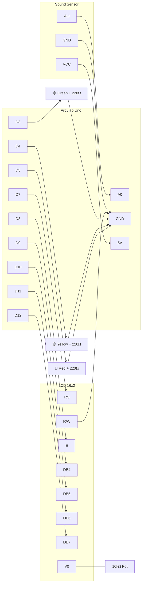
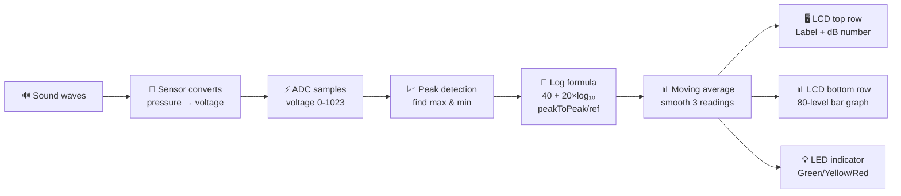
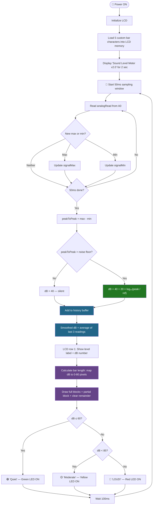

# 🔊 Sound Level Meter v2.0 — Logarithmic dB + LCD Bar Graph

This is the upgraded version of my sound level meter. After using v1 for a while, three things bothered me: the dB readings felt compressed and inaccurate, the number flickered constantly, and just staring at a number isn't great for quick visual feedback. So I rewrote the core logic with the **actual logarithmic decibel formula**, added a **smooth bar graph** on the LCD bottom row using custom characters, and threw in a **moving average filter** to kill the flicker. Same hardware, much better result.


> ▶ [Demo video](https://youtube.com/shorts/uJp66_pOYUA?si=NUtQGholeqavDKd9)

---

## What Changed From v1

| | v1.0 | v2.0 |
|---|---|---|
| dB math | `map()` — linear, not accurate | `20 × log₁₀(P/P_ref)` — real formula |
| Display | Just a number | Number + animated bar graph |
| Smoothing | None — numbers jump everywhere | 3-sample moving average filter |
| Bar resolution | N/A | 80 levels (16 cells × 5 pixels each) |
| Feels like | A rough prototype | An actual instrument |

---

## What It Looks Like Now

```
┌────────────────┐
│ Quiet     52 dB│   ← level label + number
│ █████████      │   ← bar graph grows with noise
└────────────────┘

Clap your hands:

┌────────────────┐
│ LOUD!     87 dB│
│ ██████████████ │   ← bar shoots across the screen
└────────────────┘
```

The bar responds in real time. It grows when things get loud and shrinks back when it's quiet. Way more satisfying to watch than a flickering number.

---

## Parts (Same as v1)

| Part | Role |
|------|------|
| Arduino Uno R3 | Runs everything |
| 16x2 LCD (parallel HD44780) | Number on top row, bar graph on bottom row |
| Analog sound sensor | Picks up noise |
| 10kΩ Potentiometer | LCD contrast |
| Green LED + 220Ω | Quiet indicator |
| Yellow LED + 220Ω | Moderate indicator |
| Red LED + 220Ω | Loud indicator |
| Breadboard + wires | Connections |

No new parts needed — the upgrade is purely in the code.

---

## Wiring (Same as v1)

### LCD

| LCD Pin | Name | Goes To |
|---------|------|---------|
| 1 | VSS | GND |
| 2 | VDD | 5V |
| 3 | V0 | Potentiometer middle pin |
| 4 | RS | Arduino D7 |
| 5 | R/W | **GND** |
| 6 | E | Arduino D8 |
| 7–10 | DB0–DB3 | Nothing |
| 11 | DB4 | Arduino D9 |
| 12 | DB5 | Arduino D10 |
| 13 | DB6 | Arduino D11 |
| 14 | DB7 | Arduino D12 |
| 15 | LED+ | 5V |
| 16 | LED- | GND |

### Sound Sensor

| Pin | Arduino |
|-----|---------|
| AO | A0 |
| VCC | 5V |
| GND | GND |

### LEDs

| LED | Pin | Resistor |
|-----|-----|----------|
| Green | D3 | 220Ω to GND |
| Yellow | D4 | 220Ω to GND |
| Red | D5 | 220Ω to GND |

---

## Circuit Diagram



---

## The Three Upgrades Explained

### Upgrade 1: Real Logarithmic dB Formula

v1 used this:
```cpp
int db = map(peakToPeak, 20, 900, 49, 90);
```

v2 uses this:
```cpp
db = DB_MIN + 20.0 * log10(peakToPeak / ADC_REF);
```

This is the actual decibel formula: **L = 20 × log₁₀(P / P_ref)**. I can't measure real Pascals with this cheap sensor, but I can apply the same logarithmic math to my ADC readings. The ratio `peakToPeak / ADC_REF` tells me how many times louder the current sound is compared to the quiet baseline.

Why does it matter? Here's the same sensor readings through both formulas:

| Peak-to-Peak | v1 (linear) | v2 (logarithmic) | What's actually happening |
|---|---|---|---|
| 20 | 49 dB | 40.0 dB | Quiet room |
| 40 | 50 dB | 46.0 dB | Soft speech — pressure doubled, should be +6 dB |
| 80 | 52 dB | 52.0 dB | Normal conversation — doubled again, +6 dB |
| 200 | 58 dB | 60.0 dB | Louder talking |
| 400 | 67 dB | 66.0 dB | Loud — doubled from 200, +6 dB |
| 900 | 90 dB | 73.1 dB | Very loud |

v2 consistently adds ~6 dB every time the pressure doubles. That's physically correct. v1 adds random amounts (1 dB, 2 dB, 9 dB, 23 dB) because linear mapping doesn't match logarithmic reality. The v2 readings also feel much more natural when you're actually using the meter — quiet and moderate sounds are properly spread out instead of being squished together.

### Upgrade 2: LCD Bar Graph with Custom Characters

The HD44780 LCD chip lets you define up to 8 custom characters. I made 5 that fill different widths of a cell:

```
bar1: █░░░░   → 1 pixel column filled
bar2: ██░░░   → 2 columns
bar3: ███░░   → 3 columns
bar4: ████░   → 4 columns
bar5: █████   → full cell (5 columns)
```

Each LCD cell is 5 pixels wide. With 16 cells across the bottom row, that's 16 × 5 = **80 distinct bar positions**. The code figures out how many full cells to draw and whether the last cell needs a partial fill:

```cpp
int fullBlocks = barLength / 5;     // how many complete cells
int remainder  = barLength % 5;     // partial fill for last cell
```

So if the bar should be 37 pixels long: 37/5 = 7 full blocks, 37%5 = 2 pixel remainder. Draw 7 full blocks then one `bar2` character. It looks smooth and responsive.

### Upgrade 3: Moving Average Filter

v1 readings jumped around constantly — you'd see 54, 61, 55, 63, 52 in a quiet room. That's because each 50ms sample window captures slightly different noise. In v2, I average the last 3 readings before displaying:

```cpp
dbHistory[historyIndex] = db;
historyIndex = (historyIndex + 1) % 3;
dbSmoothed = (dbHistory[0] + dbHistory[1] + dbHistory[2]) / 3.0;
```

This is a **moving average filter** — the simplest digital filter that exists. It removes random jitter while still responding fast to real volume changes. The difference in LCD readability is night and day. The bar moves smoothly instead of vibrating chaotically.

---

## Signal Flow



---

## Full Algorithm Flowchart



🟢 Green = logarithmic dB formula
🔵 Blue = moving average filter
🟣 Purple = bar graph rendering

---

## Problems I Ran Into

### Contrast potentiometer was misleading

When I first uploaded v2, I thought the bar graph wasn't working because I could barely see it. Turns out the contrast was set fine for text but the custom characters render slightly differently — they need the contrast turned a tiny bit further. Spent 10 minutes thinking my code was broken when it was actually a hardware adjustment.

### log10(0) crashes everything

If the room is dead silent, `peakToPeak` can be 0 or very close to it. Passing 0 to `log10()` gives negative infinity, which breaks the whole calculation. I had to add a check:

```cpp
if (peakToPeak <= ADC_REF) {
    db = DB_MIN;  // floor it at 40 dB
}
```

Seems obvious in hindsight but I only discovered it when the LCD briefly showed garbage characters during a quiet moment.

### Finding the right sensitivity range

The `ADC_REF = 20.0` and the `map()` range for the bar graph needed trial and error. If `ADC_REF` is too low, the meter reads high even in silence. If it's too high, soft sounds don't register at all. I tested it by sitting in a quiet room, checking what the Serial Monitor showed as the baseline peak-to-peak, and setting `ADC_REF` slightly above that. Different sensors will need different values — there's no universal number.

### Bar graph flickering on first attempt

My first bar implementation called `lcd.clear()` every loop then redrew everything. The clear-and-redraw caused a visible blink. I fixed this by overwriting each cell position directly without clearing — writing a space character to empty positions and a bar character to filled ones. No more flicker.

---

## What I'd Do Next

- **Calibrate it properly** — compare readings against a real SPL meter app and create a proper calibration curve instead of guessing the reference values
- **Add peak hold** — a little marker that stays at the loudest point for a couple seconds before dropping, like professional VU meters have
- **Log to SD card** — record noise levels over time for things like monitoring a workshop or study room
- **Combine with an FFT spectrum analyzer** — show the overall volume on one display and the frequency breakdown on another
- **Port to ESP32** — add WiFi, send the data to a dashboard, get a push notification if noise exceeds 85 dB for more than 15 minutes

---

## What Building Both Versions Taught Me

**Logarithmic scales show up everywhere in engineering.** Decibels aren't just an audio thing. The same math appears in signal strength (dBm), amplifier gain, antenna design (dBi), and control system Bode plots. Understanding why we use log scales — because the phenomena they describe span huge ranges — is something I'll carry into any EE course.

**Iterating beats overplanning.** V1 took 30 minutes and worked well enough. But actually using it revealed problems I never would have predicted by just thinking about it. V2 came from real frustrations, not a spec sheet. Ship something, use it, improve it — that's how real engineering works.

**Filtering matters.** The raw signal from the sensor is noisy and jumpy. A simple 3-sample average made the output usable. In real systems, filters are everywhere — in audio equipment, power supplies, communication receivers, control loops. This tiny moving average was my first real encounter with digital filtering.

**Custom LCD characters are surprisingly powerful.** The HD44780 only gives you 8 custom slots, but with 5-pixel-wide cells and some math you can create smooth animations. It's a constraint that forces creative thinking — the same kind of constraint you'd face in embedded systems where memory and processing power are limited.

---

## Files

```
v2_logarithmic/
├── decibel_sensor_project_v2.ino    ← The code
└── README.md             ← This file
```

---

## Dependencies

- `LiquidCrystal.h` — built into Arduino IDE
- `math.h` — built into Arduino, gives us `log10()`

Nothing to install.

---